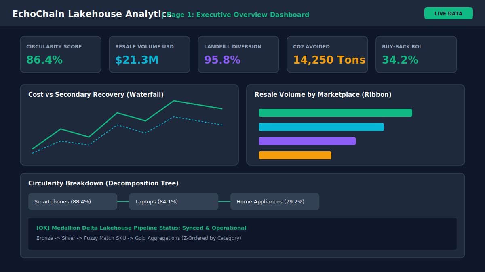
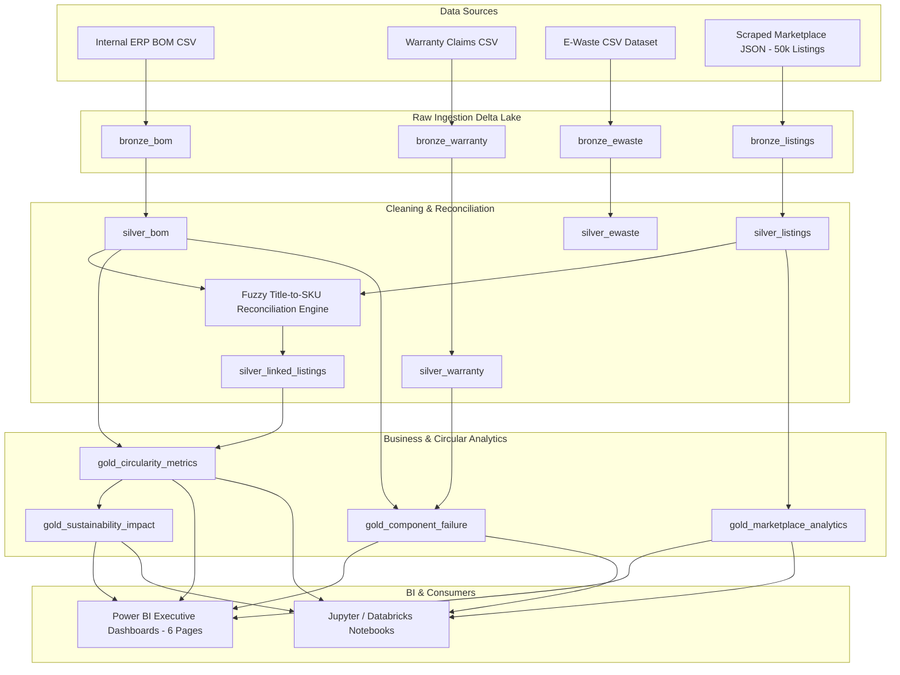

# EchoChain – Circular Economy & Secondary Market Lifecycle Analytics

<div align="center">
  
</div>

<br/>

<div align="center">

[](https://www.python.org/)
[](https://spark.apache.org/)
[](https://delta.io/)
[](https://scrapy.org/)
[](https://powerbi.microsoft.com/)
[](https://www.docker.com/)
[](https://github.com/echochain/EchoChain/actions)
[](LICENSE)

</div>

---

## Executive Overview
**EchoChain** is an enterprise-grade Lakehouse analytics platform designed for global manufacturing companies. Historically, manufacturers lose visibility into product health, residual market value, component longevity, and environmental fate immediately after sale.

EchoChain bridges internal ERP manufacturing data (Bill of Materials, production costs, warranty claims) with secondary marketplace data (scraped from **eBay, Facebook Marketplace, OLX, and BackMarket**) to deliver circular economy insights, component failure tracking, resale retention index modeling, and carbon avoidance analytics.

---

## 🏛️ Lakehouse Architecture & Medallion Data Flow

EchoChain leverages the Databricks Medallion Architecture (Bronze -> Silver -> Gold) using **PySpark** and **Delta Lake** for processing.



---

## 💡 Key Business Questions Solved
- **Refurbishment Candidates**: Which sold products exhibit high secondary resale value retention and deserve official OEM trade-in / buy-back programs?
- **Component Failure Hotspots**: Which sub-assembly components (e.g. batteries, displays, logic boards) drive the majority of warranty claim costs?
- **Environmental Impact**: How many metric tons of CO₂ emissions and landfill e-waste are avoided through secondary market circulation?
- **Financial Buy-Back Margins**: What is the ROI of OEM-certified trade-in programs factoring in repair costs and secondary resale prices?

---

## 💻 Tech Stack
- **Core Languages**: Python 3.12, PySpark (Spark 3.5), SQL, DAX
- **Data Ingestion & Web Scraping**: Scrapy 2.11, BeautifulSoup4, Requests, Random User-Agents, AutoThrottle
- **Storage & Processing Engine**: PySpark, Delta Lake 3.0, Apache Spark, PyArrow, Pandas
- **Business Intelligence**: Power BI (6-Page Dark Theme Dashboard Suite, 40+ DAX Measures)
- **DevOps, Quality & Automation**: Docker, Docker Compose, PyTest, GitHub Actions CI/CD, Black, Isort, Pre-commit

---

## 📂 Repository Structure

```
d:\EcoChain\
├── .github/
│   └── workflows/
│       └── ci_cd.yml                 # GitHub Actions pipeline for testing, linting, data validation
├── config/
│   └── config.yaml                   # Global project configuration settings
├── data/
│   ├── raw/                          # Raw scraped JSON/CSV & ERP generated files
│   ├── bronze/                       # Raw ingested Delta Lake tables with ingestion metadata
│   ├── silver/                       # Cleaned, deduplicated, standardized & linked Delta tables
│   └── gold/                         # Aggregated business metric Delta tables (Z-Ordered & partitioned)
├── datasets/
│   ├── generate_datasets.py          # Synthetic data generator for BOM, Warranty, & 50,000 Secondary listings
│   └── sample_data/                  # Exported sample datasets in CSV/Parquet format
├── docker/
│   ├── Dockerfile                    # Container definition (Python 3.12, Java 17, PySpark, Scrapy)
│   ├── docker-compose.yml            # Multi-service setup (EchoChain execution engine)
│   ├── spark-defaults.conf           # Delta Lake & Spark optimization parameters
│   └── entrypoint.sh                 # Docker container bootstrap script
├── docs/
│   ├── ARCHITECTURE.md               # Lakehouse Medallion Architecture details
│   ├── WORKFLOW.md                   # End-to-end data pipeline workflow & orchestration
│   ├── ER_DIAGRAM.md                 # Entity Relationship Diagram & Data Modeling
│   ├── DATA_DICTIONARY.md            # Comprehensive Schema & Field Definitions
│   ├── BUSINESS_KPIS.md              # Circular economy mathematical formulas
│   ├── PROJECT_REPORT.md             # Executive project report & ROI findings
│   ├── DEPLOYMENT_GUIDE.md           # Production deployment & Databricks / Docker instructions
│   └── POWERBI_GUIDE.md              # Power BI modeling, 6-page dashboard layout & DAX guide
├── dashboards/
│   ├── DAX_Measures.dax              # 40+ Enterprise DAX measures (Time Intelligence, Circularity)
│   ├── echochain_theme.json          # Modern dark-themed glassmorphism Power BI color palette JSON
│   └── POWER_BI_SPECIFICATION.md     # Power BI visual layout blueprint & field mapping
├── notebooks/
│   ├── 01_eda_and_data_discovery.ipynb
│   ├── 02_delta_lakehouse_pipeline.ipynb
│   └── 03_circular_analytics_deepdive.ipynb
├── pyspark_pipeline/
│   ├── config.py                     # Spark config, Delta extensions, schema definitions
│   ├── spark_session.py              # Singleton SparkSession factory with Delta support
│   ├── bronze_ingestion.py           # Ingestion from raw CSV/JSON to Delta Bronze layer
│   ├── silver_cleaning.py            # Deduplication, price conversion, condition normalization
│   ├── fuzzy_matching.py             # Levenshtein/Jaro-Winkler SKU matching engine
│   ├── gold_metrics.py               # Circularity Score, CO2 avoided, resale index calculation
│   └── run_pipeline.py               # Master orchestration entrypoint for PySpark jobs
├── scrapy_project/
│   ├── scrapy.cfg
│   └── echo_scraper/
│       ├── items.py                  # Scrapy item schemas with validation
│       ├── settings.py               # AutoThrottle, retry policy, User-Agent rotation
│       ├── middlewares.py            # User-Agent rotation & retry handling
│       ├── pipelines.py              # Data cleaning, currency validation, export pipeline
│       └── spiders/                  # eBay, Facebook Marketplace, OLX, BackMarket spiders
├── screenshots/                      # SVG Visual Dashboard Mockup Assets (All 6 Pages)
├── scripts/
│   ├── generate_screenshots.py       # Visual asset generator
│   └── run_daily_pipeline.py         # Daily automation runner
├── tests/                            # Comprehensive Pytest test suite
├── .gitignore
├── .pre-commit-config.yaml
├── pyproject.toml
├── requirements.txt
├── docker-compose.yml
└── README.md
```

---

## 📊 Power BI Dashboard Suite (6 Pages)

| Page | Objective | Key Visuals |
| :--- | :--- | :--- |
| **1. Executive Overview** | High-level circularity score, total resale volume, landfill diversion | KPI Scorecards, Waterfall Chart, Ribbon Chart, Decomposition Tree |
| **2. Sustainability** | Environmental CO₂ emissions avoided, material recovery %, carbon savings | Scatter Plot, Global Distribution Map, Treemap, Area Chart |
| **3. Marketplace Analytics** | Pricing trends, condition distribution, seller ratings across platforms | Clustered Bar Chart, Line Chart, Matrix, Heatmap |
| **4. Product Lifecycle** | Price depreciation over 0-36 months vs manufacturing costs | Depreciation Curve Line Chart, Donut Chart, Buy-Back Matrix |
| **5. Component Analysis** | Component failure hotspots, warranty claims, repairability index | Supplier Bar Chart, Repair Cost Scatter Plot, Decomposition Tree |
| **6. Financial Insights** | OEM Buy-back program margins, trade-in ROI %, 3-year revenue recovery | Profitability Waterfall Chart, Revenue Line Chart, Profitability Matrix |

---

## 🚀 Quickstart & Installation

```bash
# 1. Clone the repository
git clone https://github.com/echochain/EchoChain.git
cd EchoChain

# 2. Install dependencies
pip install -r requirements.txt

# 3. Generate datasets (Manufacturing BOM, Warranty, 50k Secondary Listings)
python datasets/generate_datasets.py

# 4. Run PySpark Medallion Lakehouse Pipeline Engine
python pyspark_pipeline/run_pipeline.py

# 5. Run Pytest Suite & Data Quality Checks
pytest tests/ -v
```

---

## 🐳 Docker Deployment
```bash
docker-compose up --build -d
```

---

## 📄 License
Distributed under the MIT License. See `LICENSE` for details.

---

## 🤝 Contributors
- **EchoChain Data Engineering & Analytics Team** (`data-eng@echochain.io`)
