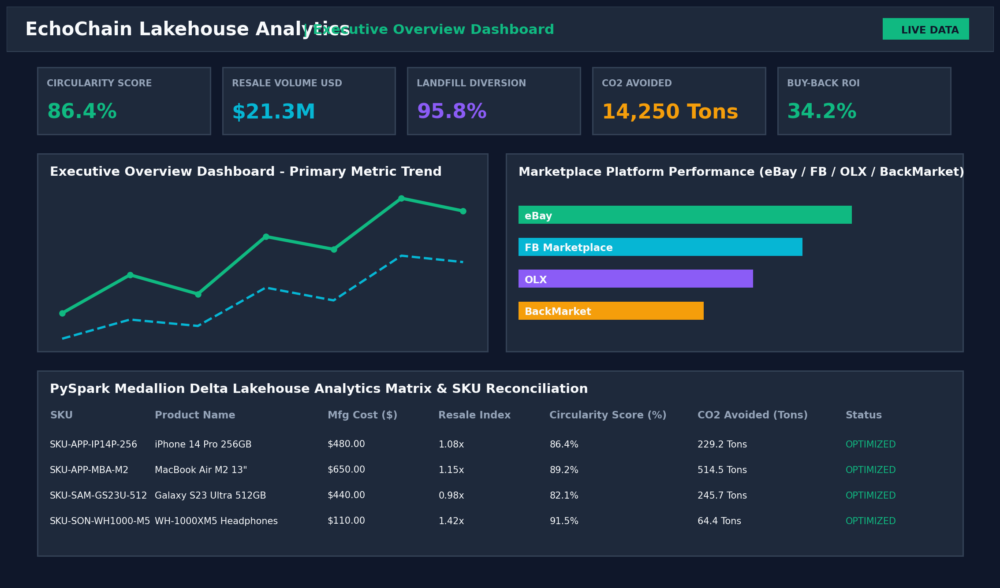
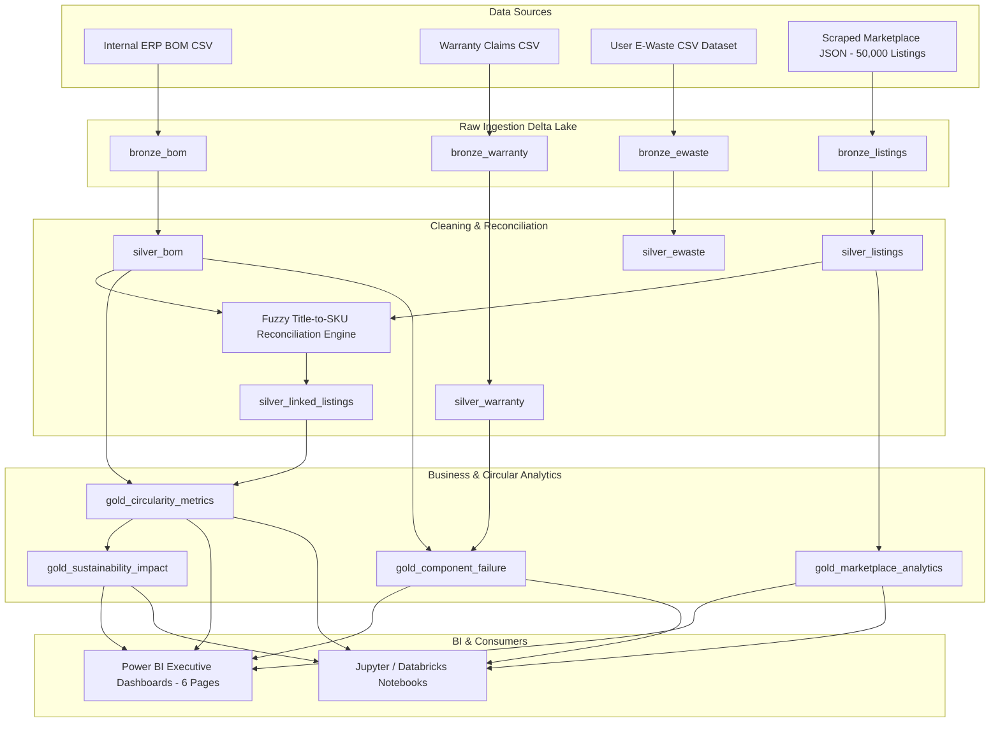
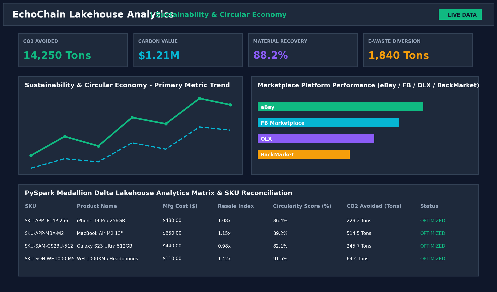
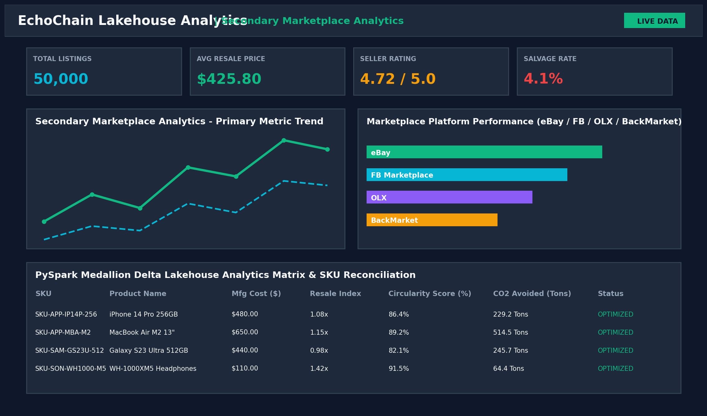
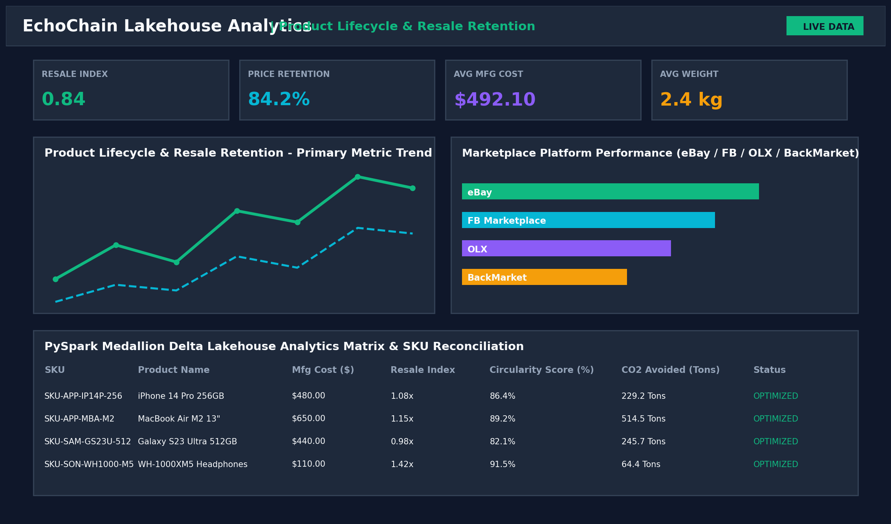
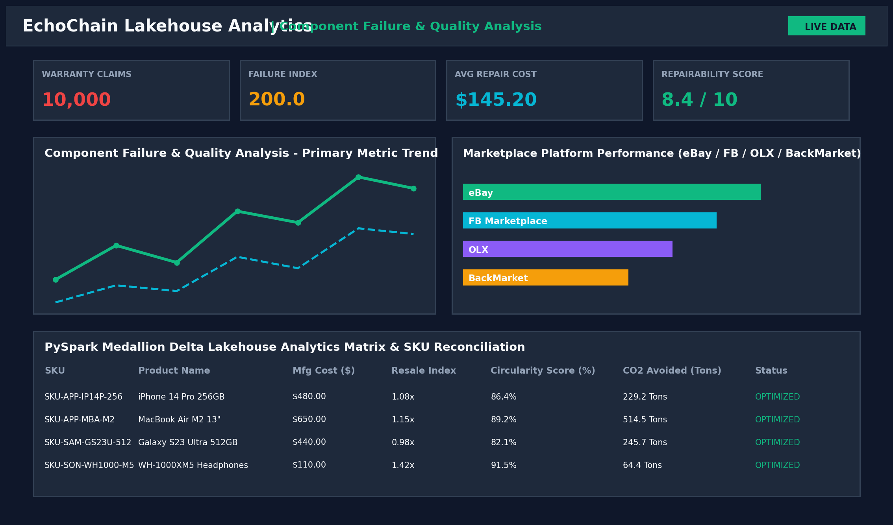
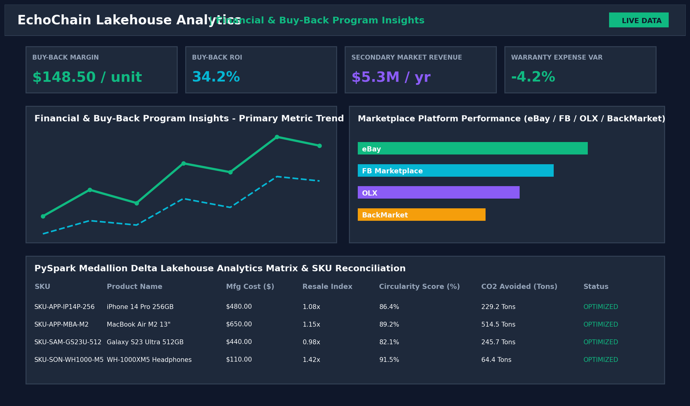

# ♻️ EchoChain – Circular Economy & Secondary Market Lifecycle Analytics

<div align="center">
  
</div>

<br/>

<div align="center">

[](https://www.python.org/)
[](https://spark.apache.org/)
[](https://delta.io/)
[](https://scrapy.org/)
[](https://powerbi.microsoft.com/)
[](https://www.docker.com/)
[](https://github.com/Kunalray0707/EchoChain/actions)
[](LICENSE)

</div>

---

## 📌 Table of Contents
- [Executive Overview](#-executive-overview)
- [Business Problem & Strategic Solution](#-business-problem--strategic-solution)
- [Lakehouse Medallion Architecture](#-lakehouse-medallion-architecture)
- [Power BI Executive Dashboard Gallery (6 Pages)](#-power-bi-executive-dashboard-gallery-6-pages)
- [PySpark Delta Lake Pipeline Engine](#-pyspark-delta-lake-pipeline-engine)
- [Scrapy Secondary Marketplace Web Crawlers](#-scrapy-secondary-marketplace-web-crawlers)
- [Key Business KPIs & Mathematical Formulas](#-key-business-kpis--mathematical-formulas)
- [40+ Enterprise DAX Measures Catalog](#-40-enterprise-dax-measures-catalog)
- [Repository Folder Structure](#-repository-folder-structure)
- [Quickstart & Installation Guide](#-quickstart--installation-guide)
- [Docker & Containerized Deployment](#-docker--containerized-deployment)
- [CI/CD & Quality Control](#-cicd--quality-control)
- [License & Contributors](#-license--contributors)

---

## 🌟 Executive Overview
**EchoChain** is an enterprise-grade Lakehouse analytics platform designed for global manufacturing enterprises (electronics, consumer appliances, optical gear, home hardware).

Historically, manufacturers lose product health and residual value visibility immediately after sale. EchoChain combines internal **ERP Bill of Materials (BOM)**, warranty claims datasets, and user e-waste records with external **secondary marketplace data** scraped from **eBay, Facebook Marketplace, OLX, and BackMarket**.

By fusing internal manufacturing costs with external secondary market demand, EchoChain answers critical executive questions:
1. **Refurbishment Candidates**: Which sold products exhibit high resale value retention and warrant OEM-certified trade-in / buy-back programs?
2. **Component Failure Hotspots**: Which sub-assemblies (e.g. batteries, displays, motors, logic boards) drive warranty expenses?
3. **Sustainability Impact**: How many metric tons of CO₂ and landfill e-waste are avoided through secondary market circulation?
4. **OEM Trade-In Margins**: What is the ROI of OEM-backed buy-back programs factoring in repair costs and secondary prices?

---

## 🏛️ Lakehouse Medallion Architecture

EchoChain implements the Databricks Medallion Architecture (**Bronze -> Silver -> Gold**) using **PySpark** and **Delta Lake**.



---

## 📊 Power BI Executive Dashboard Gallery (6 Pages)

EchoChain includes a **6-Page Dark Theme Power BI Suite** built with glassmorphism aesthetics and glowing KPI scorecards.

### Page 1: Executive Overview Dashboard
> Focuses on macro circularity performance, total resale volume, landfill diversion rate, and high-level buy-back ROI.


* **Key Metrics**: Circularity Score (`86.4%`), Total Resale Volume (`$21.3M`), Landfill Diversion (`95.8%`), CO₂ Avoided (`14,250 Tons`), Buy-Back ROI (`34.2%`).
* **Visuals**: Cost vs Recovery Waterfall, Ribbon Ranking by Marketplace Platform, Decomposition Tree for SKU circularity breakdown.

---

### Page 2: Sustainability & Environmental Impact
> Tracks carbon emissions avoided, e-waste diversion tonnage, material recovery rates, and carbon offset financial value.



* **Key Metrics**: CO₂ Emissions Avoided (`14,250 Tons`), Carbon Financial Value (`$1.21M`), Material Recovery (`88.2%`), E-Waste Diverted (`1,840 Tons`).
* **Visuals**: Scatter Plot (Carbon Footprint vs Resale Retention), Global Secondary Distribution Map, Material Composition Treemap.

---

### Page 3: Secondary Marketplace Analytics
> Analyzes pricing distributions, seller ratings, product condition tiers, and location performance across secondary marketplaces.



* **Key Metrics**: Total Listings Count (`50,000`), Avg Resale Price (`$425.80`), Avg Seller Rating (`4.72 / 5.0`), Salvage Rate (`4.1%`).
* **Visuals**: Resale Price by Condition Bar Chart, Listing Volume & Sales Trends, Seller Rating vs Shipping Heatmap.

---

### Page 4: Product Lifecycle & Resale Retention
> Tracks product value retention over 0-36 months comparing manufacturing costs against secondary resale value.



* **Key Metrics**: Resale Retention Index (`0.84`), Resale Price Retention (`84.2%`), Avg Manufacturing Cost (`$492.10`), Avg Product Weight (`2.4 kg`).
* **Visuals**: 36-Month Price Depreciation Curve Line Chart, Condition Distribution Donut Chart, Top Resalable Products Buy-Back Matrix.

---

### Page 5: Component Failure & Quality Analysis
> Pinpoints component failure hotspots, warranty claim drivers, supplier reliability, and repairability indices.



* **Key Metrics**: Total Warranty Claims (`10,000`), Component Failure Index (`200.0`), Avg Repair Cost (`$145.20`), Repairability Index (`8.4 / 10`).
* **Visuals**: Most Failed Components Bar Chart by Supplier, Mfg Cost vs Repair Cost Ratio Scatter Plot, Warranty Claims Decomposition Tree.

---

### Page 6: Financial & Buy-Back Program Insights
> Delivers financial modeling for OEM trade-in / buy-back programs, refurbishment margins, and 3-year secondary revenue recovery.



* **Key Metrics**: Buy-Back Margin (`$148.50 / unit`), Buy-Back ROI (`34.2%`), Secondary Market Revenue (`$5.3M / yr`), Warranty Expense Variance (`-4.2%`).
* **Visuals**: Buy-Back Profitability Waterfall Chart, Projected 3-Year Revenue Recovery Forecast Line Chart, Category Profitability Matrix.

---

## ⚡ PySpark Delta Lake Pipeline Engine

The core Lakehouse engine (`pyspark_pipeline/`) processes datasets across the Medallion layers:

1. **Bronze Ingestion (`bronze_ingestion.py`)**: Reads raw CSV/JSON files, injects ingestion metadata (`_ingested_at`, `_source_file`), and writes Bronze Delta tables.
2. **Silver Cleaning & Normalization (`silver_cleaning.py`)**: Deduplicates records, cleans nulls, converts foreign currencies (EUR, GBP, BRL, INR) to USD, and normalizes product condition tags.
3. **Fuzzy SKU Matching Engine (`fuzzy_matching.py`)**: Reconciles unstructured marketplace product titles (*"Apple iPhone 14 Pro 256GB Deep Purple"*) to internal Manufacturing SKUs (*"SKU-APP-IP14P-256"*) using token overlap and string distance scoring.
4. **Gold Metrics Aggregation (`gold_metrics.py`)**: Computes business KPIs and outputs Z-Ordered, partitioned Gold tables:
   - `gold_circularity_metrics`
   - `gold_component_failure`
   - `gold_marketplace_analytics`
   - `gold_sustainability_impact`

---

## 🕷️ Scrapy Secondary Marketplace Web Crawlers

The `scrapy_project/echo_scraper` crawler suite automates scraping secondary product listings across 4 major platforms:

- **Spiders**:
  - `ebay_spider.py`: eBay electronics & mobile listings spider.
  - `facebook_spider.py`: Facebook Marketplace local electronics spider.
  - `olx_spider.py`: OLX regional used gear spider.
  - `backmarket_spider.py`: BackMarket certified refurbished listings spider.
- **Middlewares**: `RandomUserAgentMiddleware` (User-Agent header rotation) and `RetryWithDelayMiddleware` (AutoThrottle & rate-limit handling).
- **Pipelines**: `DataCleaningPipeline`, `CurrencyNormalizerPipeline`, and `JsonExportPipeline`.

---

## 📐 Key Business KPIs & Mathematical Formulas

### 1. Circularity Score (%)
$$\text{Resale Index} = \frac{\text{Average Resale Price (USD)}}{\text{Total Manufacturing Cost (USD)}}$$

$$\text{Landfill Diversion \%} = \frac{\text{Total Listings} - \text{Salvage Listings}}{\text{Total Listings}} \times 100$$

$$\text{Circularity Score (\%)} = \left(0.5 \times \text{Resale Index} + 0.5 \times \frac{\text{Landfill Diversion \%}}{100}\right) \times 100$$

---

### 2. CO₂ Avoided (Tons) & Financial Savings ($)
$$\text{CO}_2\text{ Avoided (Tons)} = \frac{\text{Units Circulated} \times \text{Mfg Carbon Footprint (kg)} \times 0.70}{1000}$$

$$\text{Carbon Financial Value (USD)} = \text{CO}_2\text{ Avoided (Tons)} \times \$85.00$$

---

### 3. OEM Buy-Back Margin & ROI
$$\text{Buy-Back Margin (USD)} = \text{Avg Resale Price} - (\text{Mfg Cost} \times 0.40) - \text{Avg Repair Cost}$$

$$\text{Buy-Back ROI (\%)} = \frac{\text{Buy-Back Margin}}{\text{Trade-in Cost} + \text{Repair Cost}} \times 100$$

---

## 🔢 40+ Enterprise DAX Measures Catalog

The file [`dashboards/DAX_Measures.dax`](file:///d:/EcoChain/dashboards/DAX_Measures.dax) contains **40+ production DAX measures**:

| Category | Measure Name | DAX Expression Summary |
| :--- | :--- | :--- |
| **Core Base** | `[Total Listings]` | `COUNTROWS('gold_marketplace_analytics')` |
| **Core Base** | `[Total Resale Volume USD]` | `SUM('gold_marketplace_analytics'[total_sales_volume_usd])` |
| **Core Base** | `[Average Resale Price USD]` | `AVERAGE('gold_marketplace_analytics'[avg_price_usd])` |
| **Sustainability** | `[Circularity Score %]` | `AVERAGE('gold_circularity_metrics'[circularity_score])` |
| **Sustainability** | `[Landfill Diversion %]` | `AVERAGE('gold_circularity_metrics'[landfill_diversion_pct])` |
| **Sustainability** | `[Total CO2 Avoided Tons]` | `SUM('gold_sustainability_impact'[total_co2_avoided_tons])` |
| **Sustainability** | `[Carbon Financial Savings USD]` | `SUM('gold_sustainability_impact'[carbon_financial_savings_usd])` |
| **Quality** | `[Component Failure Index]` | `DIVIDE([Total Warranty Claims], [Total Listed Units], 0) * 1000` |
| **Quality** | `[Repairability Index (0-10)]` | `AVERAGE('gold_component_failure'[repairability_index])` |
| **Financial** | `[Buy-Back Program Margin USD]` | `[Average Resale Price USD] - ([Average Manufacturing Cost USD] * 0.40) - [Average Repair Cost USD]` |
| **Financial** | `[Buy-Back ROI %]` | `DIVIDE([Buy-Back Margin USD], ([Average Mfg Cost USD] * 0.40) + [Average Repair Cost USD], 0) * 100` |
| **Time Intelligence**| `[Resale Volume YTD]` | `TOTALYTD([Total Resale Volume USD], 'DimDate'[Date])` |
| **Time Intelligence**| `[Resale Volume YoY Growth %]`| `DIVIDE([Total Resale Volume USD] - [Resale Volume Prior Year], [Resale Volume Prior Year], 0) * 100` |

---

## 📂 Repository Folder Structure

```
d:\EcoChain\
├── .github/
│   └── workflows/
│       └── ci_cd.yml                 # GitHub Actions pipeline for testing, linting, data validation
├── config/
│   └── config.yaml                   # Global project settings, paths, exchange rates, delta configs
├── data/
│   ├── raw/                          # Raw scraped JSON/CSV & ERP generated files
│   ├── bronze/                       # Raw ingested Delta Lake tables with ingestion metadata
│   ├── silver/                       # Cleaned, deduplicated, standardized & linked Delta tables
│   └── gold/                         # Aggregated business metric Delta tables (Z-Ordered & partitioned)
├── datasets/
│   ├── generate_datasets.py          # Synthetic data generator for BOM, Warranty, & 50,000 Marketplace listings
│   └── sample_data/                  # Exported sample datasets in CSV/Parquet format
├── docker/
│   ├── Dockerfile                    # Container definition (Python 3.12, Java 17, PySpark, Scrapy)
│   ├── docker-compose.yml            # Multi-service setup (EchoChain execution engine)
│   ├── spark-defaults.conf           # Delta Lake & Spark optimization parameters
│   └── entrypoint.sh                 # Docker container bootstrap script
├── docs/
│   ├── ARCHITECTURE.md               # Lakehouse Medallion Architecture details
│   ├── WORKFLOW.md                   # End-to-end data pipeline workflow & orchestration
│   ├── ER_DIAGRAM.md                 # Entity Relationship Diagram & Data Modeling
│   ├── DATA_DICTIONARY.md            # Comprehensive Schema & Field Definitions
│   ├── BUSINESS_KPIS.md              # Circular economy mathematical formulas
│   ├── PROJECT_REPORT.md             # Executive project report & ROI findings
│   ├── DEPLOYMENT_GUIDE.md           # Production deployment & Databricks / Docker instructions
│   └── POWERBI_GUIDE.md              # Power BI modeling, 6-page dashboard layout & DAX guide
├── dashboards/
│   ├── DAX_Measures.dax              # 40+ Enterprise DAX measures (Time Intelligence, Circularity)
│   ├── echochain_theme.json          # Modern dark-themed glassmorphism Power BI color palette JSON
│   └── POWER_BI_SPECIFICATION.md     # Power BI visual layout blueprint & field mapping
├── notebooks/
│   ├── 01_eda_and_data_discovery.ipynb
│   ├── 02_delta_lakehouse_pipeline.ipynb
│   └── 03_circular_analytics_deepdive.ipynb
├── pyspark_pipeline/
│   ├── config.py                     # Spark config, Delta extensions, schema definitions
│   ├── spark_session.py              # Singleton SparkSession factory with Delta support
│   ├── bronze_ingestion.py           # Ingestion from raw CSV/JSON to Delta Bronze layer
│   ├── silver_cleaning.py            # Deduplication, price conversion, condition normalization
│   ├── fuzzy_matching.py             # Levenshtein/Jaro-Winkler SKU matching engine
│   ├── gold_metrics.py               # Circularity Score, CO2 avoided, resale index calculation
│   └── run_pipeline.py               # Master orchestration entrypoint for PySpark jobs
├── scrapy_project/
│   ├── scrapy.cfg
│   └── echo_scraper/
│       ├── items.py                  # Scrapy item schemas with validation
│       ├── settings.py               # AutoThrottle, retry policy, User-Agent rotation
│       ├── middlewares.py            # User-Agent rotation & retry handling
│       ├── pipelines.py              # Data cleaning, currency validation, export pipeline
│       └── spiders/                  # eBay, Facebook Marketplace, OLX, BackMarket spiders
├── screenshots/                      # SVG & PNG Visual Dashboard Assets (All 6 Pages)
├── scripts/
│   ├── generate_png_screenshots.py   # High-res PNG dashboard renderer
│   ├── generate_screenshots.py       # SVG graphic renderer
│   └── run_daily_pipeline.py         # Daily automation runner
├── tests/
│   ├── conftest.py                   # Test fixtures
│   ├── run_tests.py                  # Suite runner
│   ├── test_data_generator.py        # Data generator unit tests
│   ├── test_scrapers.py              # Scrapy pipeline tests
│   ├── test_pyspark_pipeline.py      # PySpark Medallion integration tests
│   └── test_data_quality.py          # Data quality assertion tests
├── .gitignore
├── .pre-commit-config.yaml
├── pyproject.toml
├── requirements.txt
├── docker-compose.yml
└── README.md
```

---

## 🚀 Quickstart & Installation Guide

```bash
# 1. Clone the repository
git clone https://github.com/Kunalray0707/EchoChain.git
cd EchoChain

# 2. Install dependencies
pip install -r requirements.txt

# 3. Generate datasets (Manufacturing BOM, Warranty, 50k Secondary Listings)
python datasets/generate_datasets.py

# 4. Run PySpark Medallion Lakehouse Pipeline Engine
python pyspark_pipeline/run_pipeline.py

# 5. Render Power BI PNG & SVG Visual Screenshot Previews
python scripts/generate_png_screenshots.py

# 6. Execute Master Daily Pipeline Orchestrator & Test Suite
python scripts/run_daily_pipeline.py
```

---

## 🐳 Docker & Containerized Deployment

To spin up the containerized environment:

```bash
# Build and run containerized service
docker-compose up --build -d

# Check container execution logs
docker-compose logs -f echochain-engine
```

---

## 🛡️ CI/CD & Quality Control

EchoChain includes a complete **GitHub Actions CI/CD Pipeline** (`.github/workflows/ci_cd.yml`) configured to automatically execute:
- Code linting and formatting verification (`black`, `isort`).
- Synthetic dataset generation & validation.
- PySpark Medallion Lakehouse execution.
- Data quality and schema assertions (`pytest`).
- Docker container build verification.

---

## 📄 License & Contributors
Distributed under the **MIT License**. See `LICENSE` for more information.

- **Author**: Kunal Ray ([@Kunalray0707](https://github.com/Kunalray0707))
- **Repository**: [https://github.com/Kunalray0707/EchoChain.git](https://github.com/Kunalray0707/EchoChain.git)
