# ♻️ EchoChain — Circular Economy & Secondary Market Lifecycle Analytics

<div align="center">
  
  
  
  
  
  
  
  
  
</div>

<br/>

<p align="center">
  <b>Enterprise-grade Lakehouse platform that fuses internal manufacturing ERP data with external secondary-market intelligence</b><br/>
  to maximize circularity, unlock buy-back ROI, and quantify sustainability impact in real time.
</p>

---

## 📖 Table of Contents
- [🚀 Live Interactive Dashboard](#-live-interactive-dashboard)
- [🧠 Executive Overview](#-executive-overview)
- [🏛️ Lakehouse Medallion Architecture](#️-lakehouse-medallion-architecture)
- [📊 Streamlit Analytics Suite (6 Pages)](#-streamlit-analytics-suite-6-pages)
- [📈 Power BI Executive Dashboard Gallery](#-power-bi-executive-dashboard-gallery)
- [⚡ PySpark Delta Lake Pipeline Engine](#-pyspark-delta-lake-pipeline-engine)
- [🕷️ Scrapy Marketplace Crawlers](#️-scrapy-marketplace-crawlers)
- [📐 Key Business KPIs & Formulas](#-key-business-kpis--formulas)
- [🔢 40+ Enterprise DAX Measures](#-40-enterprise-dax-measures)
- [🗂️ Repository Structure](#️-repository-structure)
- [🚀 Quickstart](#-quickstart)
- [🐳 Docker Deployment](#-docker-deployment)
- [🛡️ CI/CD & Quality](#️-cicd--quality)
- [📄 License & Contributors](#-license--contributors)

---

# 🚀 Live Interactive Dashboard

Experience the entire EchoChain analytics suite through a beautiful, responsive **Streamlit dashboard** — a 6-page executive command center with dark glassmorphism theming and interactive Plotly charts.

<div align="center">
  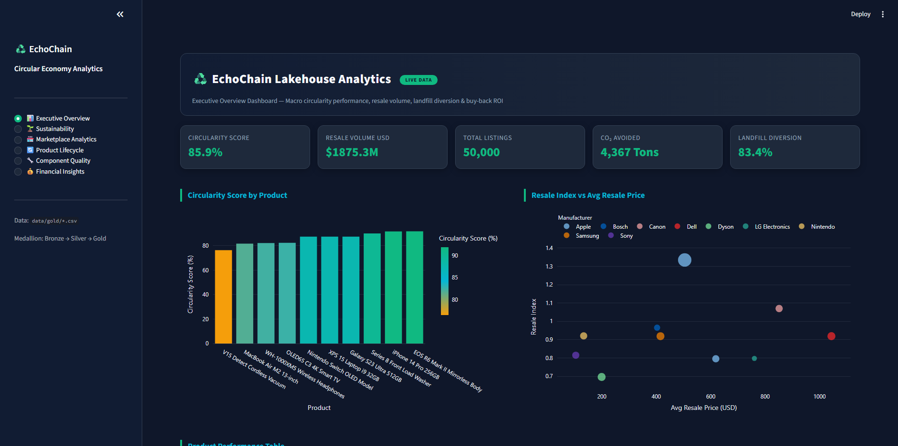
  <br/>
  <sub>📊 Page 1 — Executive Overview</sub>
</div>

<br/>

> ### ▶️ Launch it now
> ```bash
> pip install -r requirements.txt
> streamlit run dashboards/streamlit_app.py
> ```
> Then open **http://localhost:8501** 🎉

---

# 🧠 Executive Overview

**EchoChain** is an enterprise-grade Lakehouse analytics platform designed for global manufacturing enterprises (electronics, consumer appliances, optical gear, home hardware).

Historically, manufacturers lose product health and residual value visibility immediately after the point of sale. EchoChain bridges that gap by combining **internal ERP Bill of Materials (BOM)**, **warranty claims**, and **user e-waste records** with **external secondary-marketplace data** scraped from **eBay, Facebook Marketplace, OLX, and BackMarket**.

By fusing internal manufacturing costs with external secondary-market demand, EchoChain answers four critical executive questions:

| 🎯 Question | 🔍 Insight Delivered |
| :--- | :--- |
| **Refurbishment Candidates** | Which sold products retain high resale value and warrant OEM-certified trade-in / buy-back programs? |
| **Component Failure Hotspots** | Which sub-assemblies (batteries, displays, motors, logic boards) drive warranty expense? |
| **Sustainability Impact** | How many metric tons of CO₂ and landfill e-waste are avoided through secondary circulation? |
| **OEM Trade-In Margins** | What is the ROI of OEM-backed buy-back programs after factoring in repair cost and resale price? |

---

# 🏛️ Lakehouse Medallion Architecture

EchoChain implements the industry-standard **Databricks Medallion Architecture (Bronze → Silver → Gold)** with **PySpark** and **Delta Lake**, ensuring auditability, quality, and performance at every layer.

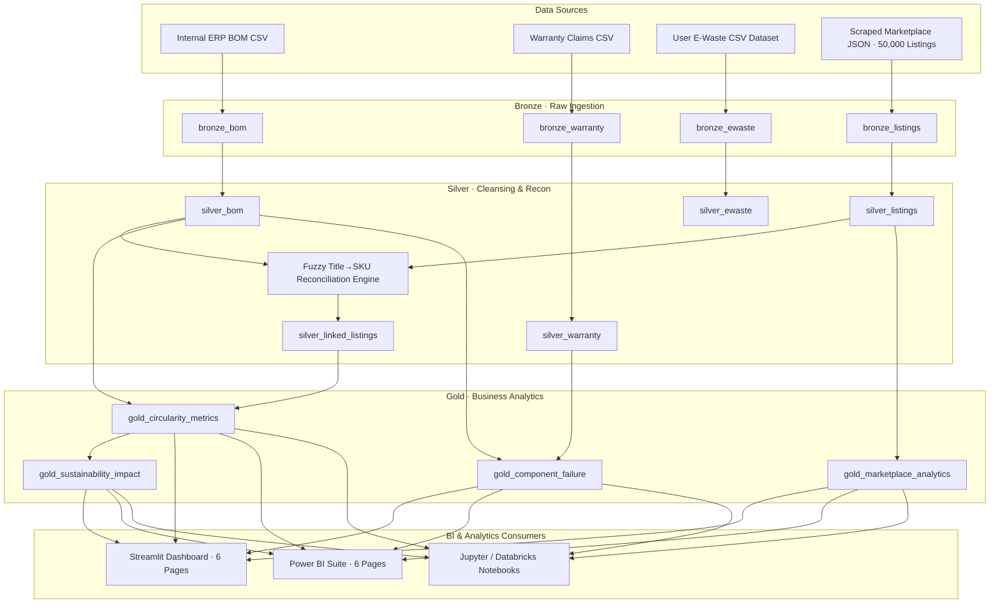
```mermaid
flowchart TD
    subgraph Data Sources
        RAW1[Internal ERP BOM CSV]
        RAW2[Warranty Claims CSV]
        RAW3[User E-Waste CSV Dataset]
        RAW4[Scraped Marketplace JSON · 50,000 Listings]
    end

    subgraph Bronze Layer [Bronze · Raw Ingestion]
        B1[bronze_bom]
        B2[bronze_warranty]
        B3[bronze_ewaste]
        B4[bronze_listings]
    end

    subgraph Silver Layer [Silver · Cleansing & Recon]
        S1[silver_bom]
        S2[silver_warranty]
        S3[silver_ewaste]
        S4[silver_listings]
        FUZZY[Fuzzy Title→SKU Reconciliation Engine]
        S5[silver_linked_listings]
    end

    subgraph Gold Layer [Gold · Business Analytics]
        G1[gold_circularity_metrics]
        G2[gold_component_failure]
        G3[gold_marketplace_analytics]
        G4[gold_sustainability_impact]
    end

    subgraph Consumers [BI & Analytics Consumers]
        ST[Streamlit Dashboard · 6 Pages]
        PBI[Power BI Suite · 6 Pages]
        NB[Jupyter / Databricks Notebooks]
    end

    RAW1 --> B1
    RAW2 --> B2
    RAW3 --> B3
    RAW4 --> B4
    B1 --> S1
    B2 --> S2
    B3 --> S3
    B4 --> S4
    S4 & S1 --> FUZZY --> S5
    S5 & S1 --> G1
    S2 & S1 --> G2
    S4 --> G3
    G1 --> G4
    G1 & G2 & G3 & G4 --> ST
    G1 & G2 & G3 & G4 --> PBI
    G1 & G2 & G3 & G4 --> NB
```

---

# 📊 Streamlit Analytics Suite (6 Pages)

A fully interactive, self-serve analytics suite rendered with **Streamlit + Plotly** in a signature dark glassmorphism theme. Every chart is live-reactive to sidebar filters, giving stakeholders on-demand exploration of circular-economy KPIs.

### 📊 Page 1 — Executive Overview
> Macro circularity performance, total resale volume, landfill diversion, and buy-back ROI.


- **KPIs**: Circularity Score · Resale Volume USD · Total Listings · CO₂ Avoided · Landfill Diversion
- **Visuals**: Circularity by Product (bar), Resale Index vs Avg Resale Price (bubble), Product Performance Table

---

### 🌱 Page 2 — Sustainability & Environmental Impact
> Carbon avoided, e-waste diversion tonnage, material recovery, and carbon-offset financial value.

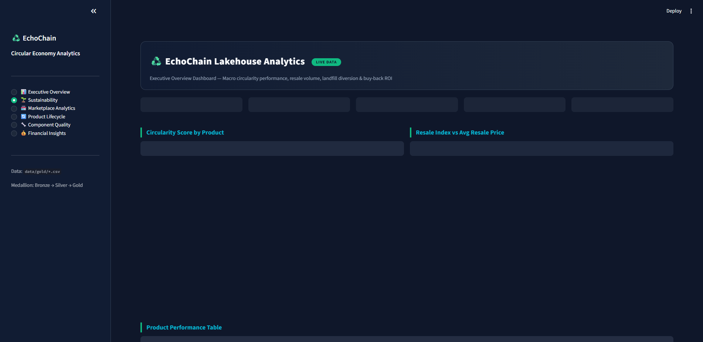

- **KPIs**: CO₂ Avoided · Carbon Value · Refurbishment Rate · Units Circulated
- **Visuals**: CO₂ by Manufacturer, Carbon Savings by Category, Circularity vs Diversion (scatter)

---

### 🏪 Page 3 — Secondary Marketplace Analytics
> Pricing distributions, seller ratings, and listing volume across all four marketplaces, with powerful sidebar filters.

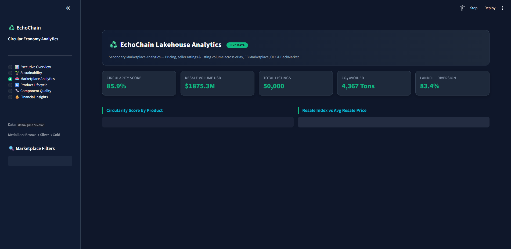

- **KPIs**: Total Listings · Avg Resale Price · Avg Seller Rating · Sales Volume
- **Visuals**: Avg Price by Condition, Listing Volume Donut, Seller Rating vs Price Heatmap
- **Filters**: Marketplace · Condition · Location

---

### 🔄 Page 4 — Product Lifecycle & Resale Retention
> Value retention and price depreciation across the product portfolio, revealing top buy-back candidates.

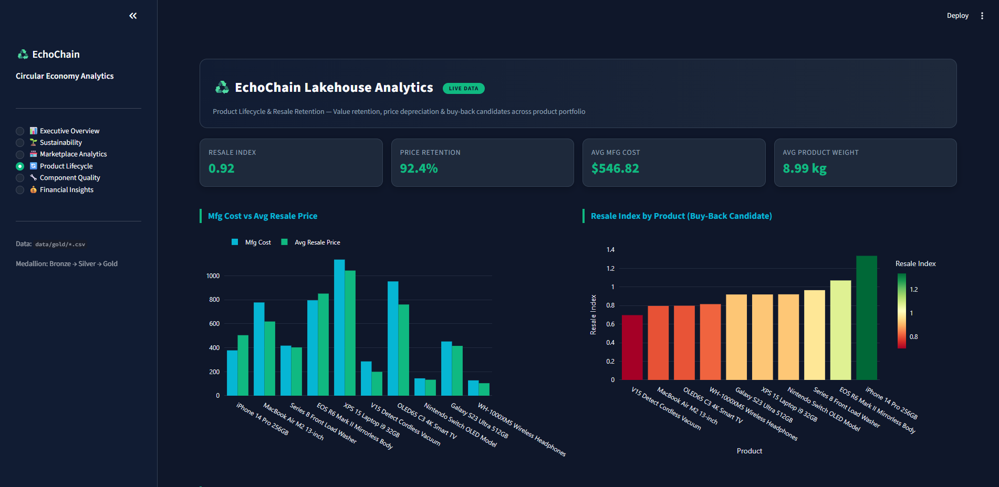

- **KPIs**: Resale Index · Price Retention · Avg Mfg Cost · Avg Product Weight
- **Visuals**: Mfg Cost vs Resale Price (grouped bars), Resale Index by Product, Condition Distribution

---

### 🔧 Page 5 — Component Failure & Quality Analysis
> Pinpoints component failure hotspots, warranty-claim drivers, supplier reliability, and repairability.

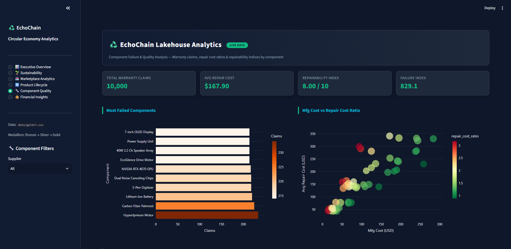

- **KPIs**: Total Warranty Claims · Avg Repair Cost · Repairability Index · Failure Index
- **Visuals**: Most Failed Components, Mfg vs Repair Cost Ratio, Component Detail Table
- **Filters**: Supplier

---

### 💰 Page 6 — Financial & Buy-Back Program Insights
> Financial modeling for OEM trade-in / buy-back programs, refurbishment margins, and secondary revenue recovery.

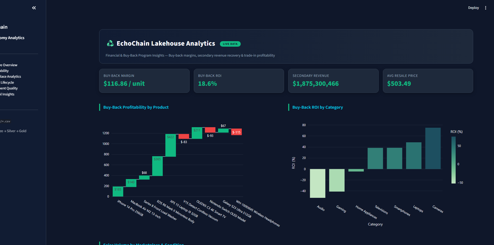

- **KPIs**: Buy-Back Margin · Buy-Back ROI · Secondary Revenue · Avg Resale Price
- **Visuals**: Buy-Back Profitability Waterfall, ROI by Category, Sales Volume by Marketplace & Condition

---

# 📈 Power BI Executive Dashboard Gallery

A production-grade **6-Page Dark Theme Power BI Suite** built with glassmorphism aesthetics and glowing KPI scorecards — the companion executive layer to the Streamlit app, powered by the same Gold tables.

| | | |
|:---:|:---:|:---:|
| **P1 · Executive Overview** | **P2 · Sustainability** | **P3 · Marketplace Analytics** |
| 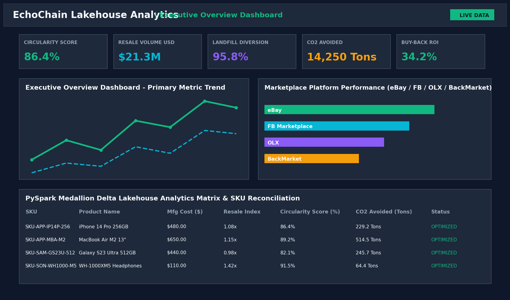 | 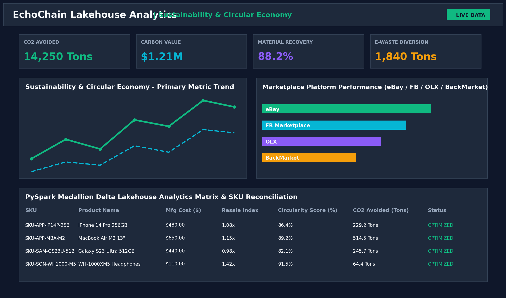 | 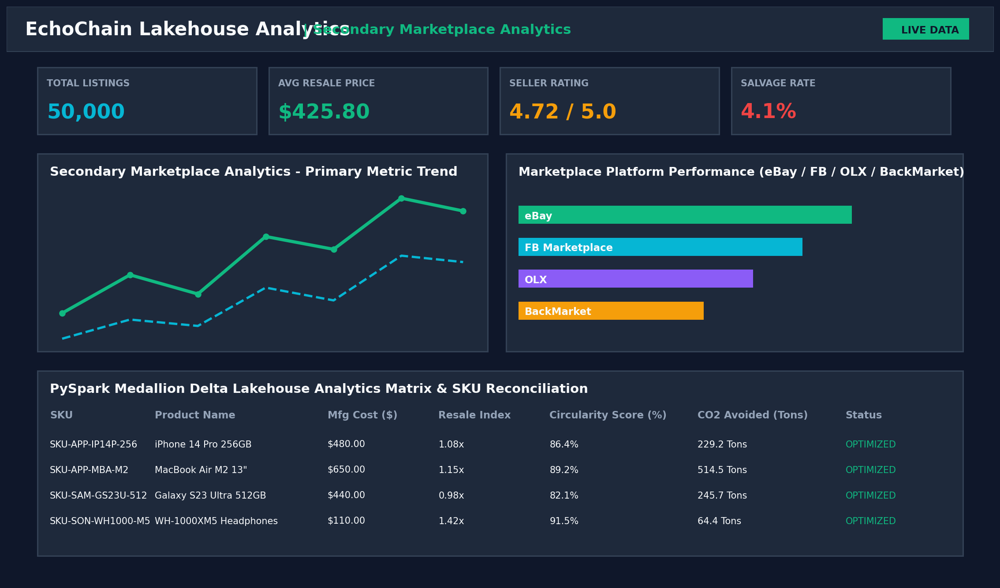 |
| **P4 · Product Lifecycle** | **P5 · Component Analysis** | **P6 · Financial Insights** |
| 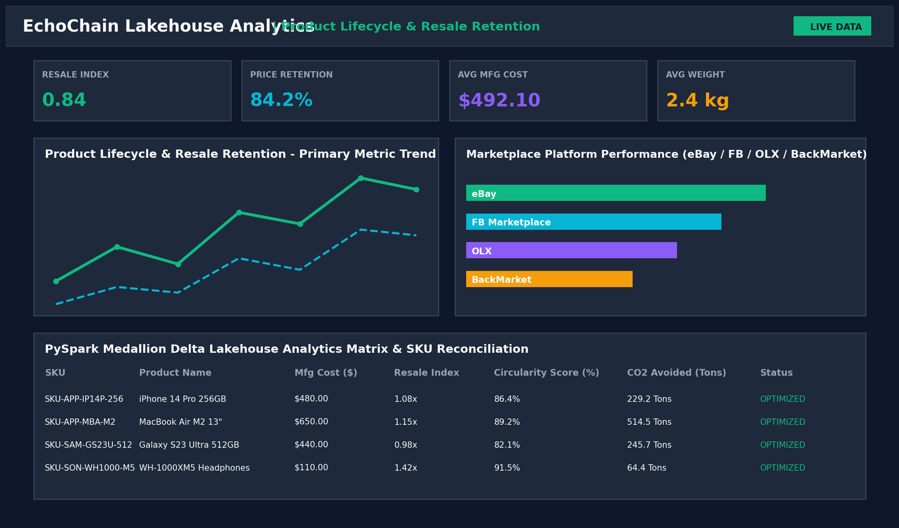 | 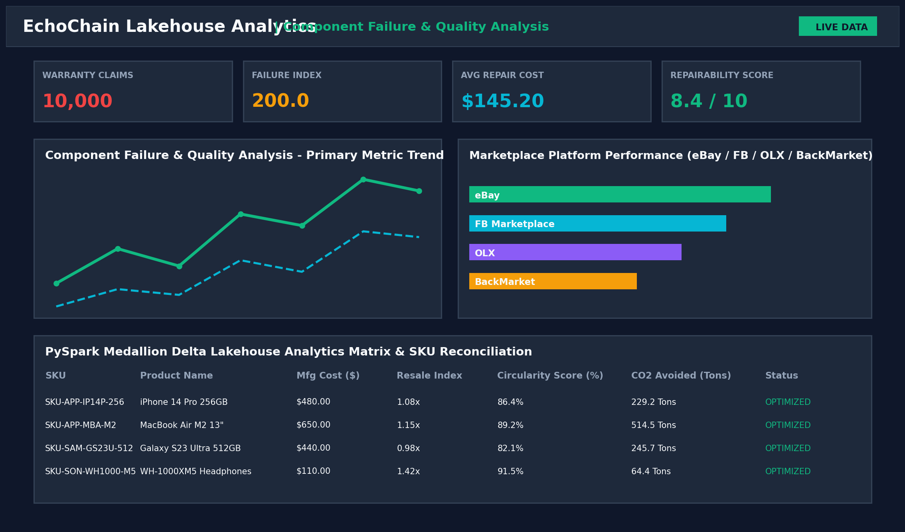 | 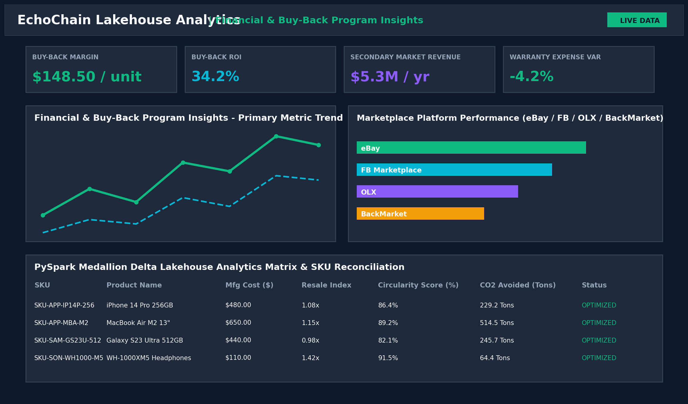 |

Key features:
- **Waterfall** for Cost vs Secondary Recovery
- **Ribbon** for Resale Volume by Marketplace
- **Decomposition Tree** for SKU circularity breakdown
- **Scatter** for Carbon Footprint vs Resale Retention
- **Treemap** for Material Composition Tonnage
- **Heatmap** for Seller Rating & Shipping Impact
- **Donut** for Condition Share Distribution
- **36-Month Price Depreciation** curve

---

# ⚡ PySpark Delta Lake Pipeline Engine

The core Lakehouse engine (`pyspark_pipeline/`) processes datasets across the Medallion layers:

1. **Bronze Ingestion** (`bronze_ingestion.py`) — Reads raw CSV/JSON, injects ingestion metadata (`_ingested_at`, `_source_file`), writes Bronze Delta tables.
2. **Silver Cleaning** (`silver_cleaning.py`) — Deduplicates records, cleans nulls, converts foreign currencies (EUR, GBP, BRL, INR) to USD, normalizes product condition tags.
3. **Fuzzy SKU Matching** (`fuzzy_matching.py`) — Reconciles unstructured marketplace titles (*"Apple iPhone 14 Pro 256GB Deep Purple"*) to internal manufacturing SKUs (*"SKU-APP-IP14P-256"*) via token overlap & string-distance scoring.
4. **Gold Metrics Aggregation** (`gold_metrics.py`) — Computes business KPIs; writes Z-Ordered, partitioned Gold tables:
   - `gold_circularity_metrics`
   - `gold_component_failure`
   - `gold_marketplace_analytics`
   - `gold_sustainability_impact`

---

# 🕷️ Scrapy Marketplace Crawlers

The `scrapy_project/echo_scraper` crawler suite automates collection of secondary-market listings from 4 major platforms:

| Spider | Platform |
| :--- | :--- |
| `ebay_spider.py` | eBay electronics & mobile listings |
| `facebook_spider.py` | Facebook Marketplace local electronics |
| `olx_spider.py` | OLX regional used gear |
| `backmarket_spider.py` | BackMarket certified refurbished |

**Middlewares**: `RandomUserAgentMiddleware` (UA rotation) + `RetryWithDelayMiddleware` (AutoThrottle & rate-limit handling).  
**Pipelines**: `DataCleaningPipeline`, `CurrencyNormalizerPipeline`, `JsonExportPipeline`.

---

# 📐 Key Business KPIs & Formulas

### 1. Circularity Score (%)
$$\text{Resale Index} = \frac{\text{Average Resale Price (USD)}}{\text{Total Manufacturing Cost (USD)}}$$

$$\text{Landfill Diversion \%} = \frac{\text{Total Listings} - \text{Salvage Listings}}{\text{Total Listings}} \times 100$$

$$\text{Circularity Score (\%)} = \left(0.5 \times \text{Resale Index} + 0.5 \times \frac{\text{Landfill Diversion \%}}{100}\right) \times 100$$

### 2. CO₂ Avoided (Tons) & Financial Savings ($)
$$\text{CO}_2\text{ Avoided (Tons)} = \frac{\text{Units Circulated} \times \text{Mfg Carbon Footprint (kg)} \times 0.70}{1000}$$

$$\text{Carbon Financial Value (USD)} = \text{CO}_2\text{ Avoided (Tons)} \times \$85.00$$

### 3. OEM Buy-Back Margin & ROI
$$\text{Buy-Back Margin (USD)} = \text{Avg Resale Price} - (\text{Mfg Cost} \times 0.40) - \text{Avg Repair Cost}$$

$$\text{Buy-Back ROI (\%)} = \frac{\text{Buy-Back Margin}}{\text{Trade-in Cost} + \text{Repair Cost}} \times 100$$

---

# 🔢 40+ Enterprise DAX Measures

Full catalog in [`dashboards/DAX_Measures.dax`](dashboards/DAX_Measures.dax).

| Category | Measure Name | DAX Expression Summary |
| :--- | :--- | :--- |
| **Core Base** | `[Total Listings]` | `COUNTROWS('gold_marketplace_analytics')` |
| **Core Base** | `[Total Resale Volume USD]` | `SUM('gold_marketplace_analytics'[total_sales_volume_usd])` |
| **Core Base** | `[Average Resale Price USD]` | `AVERAGE('gold_marketplace_analytics'[avg_price_usd])` |
| **Sustainability** | `[Circularity Score %]` | `AVERAGE('gold_circularity_metrics'[circularity_score])` |
| **Sustainability** | `[Landfill Diversion %]` | `AVERAGE('gold_circularity_metrics'[landfill_diversion_pct])` |
| **Sustainability** | `[Total CO2 Avoided Tons]` | `SUM('gold_sustainability_impact'[total_co2_avoided_tons])` |
| **Sustainability** | `[Carbon Financial Savings USD]` | `SUM('gold_sustainability_impact'[carbon_financial_savings_usd])` |
| **Quality** | `[Component Failure Index]` | `DIVIDE([Total Warranty Claims], [Total Listed Units], 0) * 1000` |
| **Quality** | `[Repairability Index (0-10)]` | `AVERAGE('gold_component_failure'[repairability_index])` |
| **Financial** | `[Buy-Back Program Margin USD]` | `[Average Resale Price USD] - ([Average Manufacturing Cost USD] * 0.40) - [Average Repair Cost USD]` |
| **Financial** | `[Buy-Back ROI %]` | `DIVIDE([Buy-Back Margin USD], ([Average Mfg Cost USD] * 0.40) + [Average Repair Cost USD], 0) * 100` |
| **Time Intelligence** | `[Resale Volume YTD]` | `TOTALYTD([Total Resale Volume USD], 'DimDate'[Date])` |
| **Time Intelligence** | `[Resale Volume YoY Growth %]` | `DIVIDE([Total Resale Volume USD] - [Resale Volume Prior Year], [Resale Volume Prior Year], 0) * 100` |

---

# 🗂️ Repository Structure

```
d:\EcoChain\
├── config/
│   └── config.yaml                   # Global settings, paths, exchange rates, Delta configs
├── data/
│   ├── raw/                          # Raw scraped JSON/CSV & ERP generated files
│   ├── bronze/                       # Raw ingested Delta tables + ingestion metadata
│   ├── silver/                       # Cleaned, deduplicated, standardized linked tables
│   └── gold/                         # Aggregated KPIs (Z-Ordered & partitioned)
├── datasets/
│   ├── generate_datasets.py          # Synthetic data generator (BOM, Warranty, 50k listings)
│   └── sample_data/                  # Exported sample datasets
├── dashboards/
│   ├── streamlit_app.py              # ⭐ 6-page interactive Streamlit dashboard
│   ├── DAX_Measures.dax              # 40+ Enterprise DAX measures
│   ├── echochain_theme.json          # Dark glassmorphism theme palette
│   └── POWER_BI_SPECIFICATION.md     # Power BI visual blueprint & field mapping
├── docker/
│   ├── Dockerfile                    # Python 3.12 + Java 17 + PySpark + Scrapy
│   ├── docker-compose.yml            # Multi-service setup
│   ├── spark-defaults.conf           # Delta Lake & Spark optimizations
│   └── entrypoint.sh                 # Container bootstrap
├── docs/                             # Architecture, KPI, ERD, deploy & Power BI guides
├── notebooks/                        # 3 EDA + Lakehouse + Circular deep-dive notebooks
├── pyspark_pipeline/
│   ├── run_pipeline.py               # Master orchestrator
│   ├── bronze_ingestion.py           # Raw → Bronze
│   ├── silver_cleaning.py            # Bronze → Silver
│   ├── fuzzy_matching.py             # Title→SKU reconciliation engine
│   ├── gold_metrics.py               # Silver → Gold aggregations
│   ├── spark_session.py              # SparkSession factory (native + mock fallback)
│   └── config.py                     # Schemas & constants
├── screenshots/                      # Dashboard assets (Streamlit + Power BI)
├── scripts/
│   ├── run_daily_pipeline.py         # Daily orchestration runner
│   ├── generate_png_screenshots.py   # High-res PNG dashboard renderer
│   ├── generate_screenshots.py       # SVG dashboard renderer
│   ├── verify_streamlit_app.py       # Streamlit API verifier
│   ├── fix_streamlit_api.py          # Legacy → modern Streamlit API migrator
│   └── capture_streamlit_screenshots.py  # Selenium screenshot capture
├── scrapy_project/                   # eBay, FB, OLX, BackMarket crawlers
├── tests/                            # Data quality + unit + integration tests
├── pyproject.toml
├── requirements.txt
├── docker-compose.yml
└── README.md
```

---

# 🚀 Quickstart

```bash
# 1. Clone
git clone https://github.com/Kunalray0707/EchoChain.git
cd EchoChain

# 2. Install dependencies
pip install -r requirements.txt

# 3. Generate synthetic datasets (BOM, Warranty, 50k Listings)
python datasets/generate_datasets.py

# 4. Run the PySpark Medallion Lakehouse pipeline
python pyspark_pipeline/run_pipeline.py

# 5. ⭐ Launch the Streamlit interactive dashboard
streamlit run dashboards/streamlit_app.py
#    → open http://localhost:8501

# 6. (Optional) Render Power BI PNG/SVG visual previews
python scripts/generate_png_screenshots.py

# 7. (Optional) Run the full daily orchestrator + test suite
python scripts/run_daily_pipeline.py
```

---

# 🐳 Docker Deployment

```bash
# Build and run the containerized environment
docker-compose up --build -d

# Follow execution logs
docker-compose logs -f echochain-engine
```

---

# 🛡️ CI/CD & Quality

The GitHub Actions pipeline (`.github/workflows/ci_cd.yml`) automatically enforces on every push:

- ✅ **Linting & formatting** — `black --check .` and `isort --check-only .` (Python 3.11 + 3.12)
- ✅ **Synthetic dataset generation & validation**
- ✅ **PySpark Medallion Lakehouse execution**
- ✅ **Data quality & schema assertions** (`pytest`)
- ✅ **Docker container build verification**

---

# 📄 License & Contributors

Distributed under the **MIT License**.

- **Author**: Kunal Ray ([@Kunalray0707](https://github.com/Kunalray0707))
- **Repository**: [https://github.com/Kunalray0707/EchoChain.git](https://github.com/Kunalray0707/EchoChain.git)

<div align="center">
  <br/>
  
  <br/><br/>
  <sub>Built with ♻️ · PySpark · Delta Lake · Streamlit · Scrapy · Power BI</sub>
</div>

