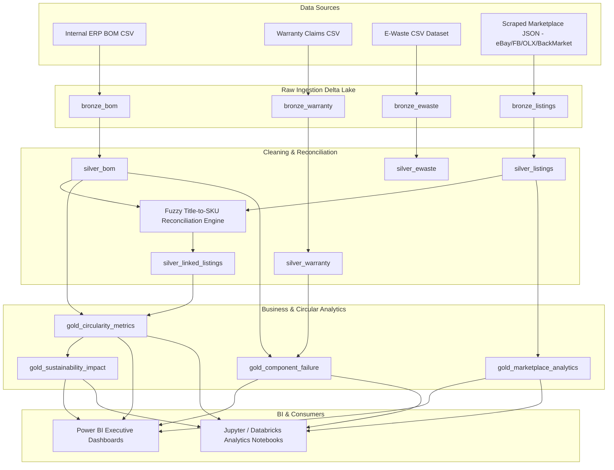

# EchoChain Lakehouse Architecture

## Medallion Lakehouse Paradigm
EchoChain implements the Databricks Medallion Architecture (Bronze -> Silver -> Gold) using PySpark and Delta Lake to process internal ERP manufacturing datasets and unstructured web-scraped secondary marketplace data.

## Layer Specifications

### Bronze Layer (Raw Storage)
- Stores raw files verbatim with append-only semantics.
- Appends operational audit metadata columns: `_ingested_at` (Timestamp) and `_source_file` (String).

### Silver Layer (Cleaned & Harmonized)
- Normalizes currency exchanges (EUR, GBP, BRL, INR to USD).
- Harmonizes product condition strings into standard taxonomy (*Like New, Refurbished, Excellent, Good, Fair, Salvage*).
- Fuzzy SKU Matching engine links unstructured listing titles to internal ERP SKUs using Levenshtein distance and regex token matching.

### Gold Layer (Aggregated Business Analytics)
- Partitioned by Category and Year.
- Z-Ordered on high cardinality columns (`SKU`, `listing_id`) for ultra-fast query performance.
