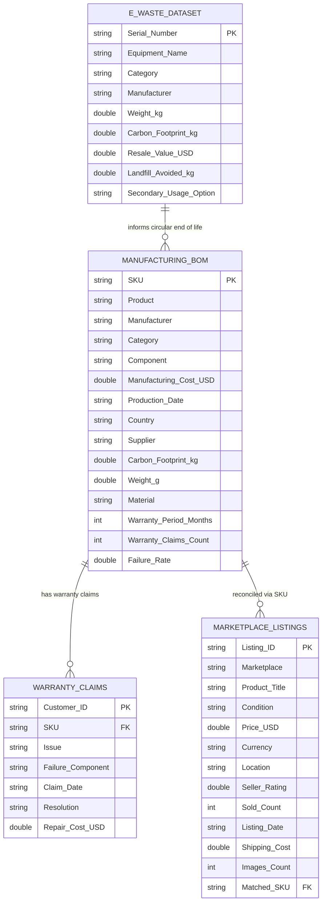

# EchoChain Entity Relationship Diagram (ERD)

```mermaid
erDiagram
    MANUFACTURING_BOM ||--o{ WARRANTY_CLAIMS : "has warranty claims"
    MANUFACTURING_BOM ||--o{ MARKETPLACE_LISTINGS : "reconciled via SKU"
    E_WASTE_DATASET ||--o{ MANUFACTURING_BOM : "informs circular end of life"

    MANUFACTURING_BOM {
        string SKU PK
        string Product
        string Manufacturer
        string Category
        string Component
        double Manufacturing_Cost_USD
        string Production_Date
        string Country
        string Supplier
        double Carbon_Footprint_kg
        double Weight_g
        string Material
        int Warranty_Period_Months
        int Warranty_Claims_Count
        double Failure_Rate
    }

    WARRANTY_CLAIMS {
        string Customer_ID PK
        string SKU FK
        string Issue
        string Failure_Component
        string Claim_Date
        string Resolution
        double Repair_Cost_USD
    }

    MARKETPLACE_LISTINGS {
        string Listing_ID PK
        string Marketplace
        string Product_Title
        string Condition
        double Price_USD
        string Currency
        string Location
        double Seller_Rating
        int Sold_Count
        string Listing_Date
        double Shipping_Cost
        int Images_Count
        string Matched_SKU FK
    }

    E_WASTE_DATASET {
        string Serial_Number PK
        string Equipment_Name
        string Category
        string Manufacturer
        double Weight_kg
        double Carbon_Footprint_kg
        double Resale_Value_USD
        double Landfill_Avoided_kg
        string Secondary_Usage_Option
    }
```
