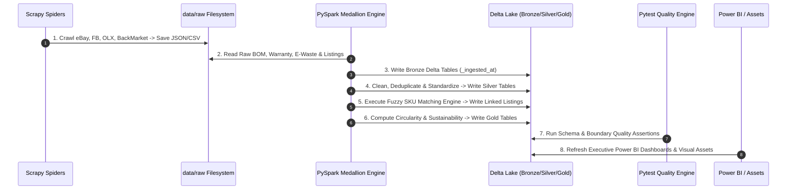

# EchoChain End-to-End Workflow & Orchestration

## Pipeline Execution Lifecycle

## Daily Automation Cron / Orchestration
The pipeline is orchestrated daily via `scripts/run_daily_pipeline.py` or containerized execution via Docker Compose.
